# 🏆 VisionSupport AI - Capstone Project Master Plan

> **AI Customer Support Agent with Visual Intelligence + Sentiment Analysis**  
> *Enterprise Agents Track | Team of 4 | 7-Day Sprint to Victory*

---

## 🎯 Project Mission Statement

**We are building the world's first AI customer support agent that can SEE and FEEL.**

- **SEES:** Processes product images for instant support (damaged items, visual search, error screenshots)
- **FEELS:** Detects customer emotions and escalates frustrated users to humans immediately
- **SOLVES:** Handles 35% of support tickets automatically with multi-agent intelligence

**Why we'll win:** While others build generic chatbots, we're delivering a visual, emotional, intelligent support experience that judges haven't seen before.

---

## 📊 Competition Context

| Factor | Status | Impact |
|--------|--------|--------|
| **Submission Deadline** | Dec 1, 2025, 11:59 AM PT (12:29 AM IST Dec 2) | ⏰ **7 DAYS REMAINING** |
| **Track** | Enterprise Agents | Perfect alignment for B2B value |
| **Team Size** | 4 members | Optimal for parallel workstreams |
| **Target Score** | 85-95 points | Top 3 contender |
| **Expected Competitors** | 100-200 submissions | High, but we have differentiation |
| **Market Validation** | E-commerce #1 in 2025 support hiring | Strong real-world relevance |

---

## 🌟 Our Unique Differentiators

### 🎨 Visual Intelligence (PRIMARY)
**What judges will see:**

```
Customer uploads photo of damaged phone case
    ↓
Visual Agent (Gemini Vision) analyzes damage
    ↓
"I can see a cracked top corner. I'm initiating a replacement order now."
    ↓
Return auto-processed, shipping label generated
```

**Technology:** Gemini 2.0 Flash Vision API  
**Wow Factor:** 🔥🔥🔥🔥🔥 (HIGH - nobody else will have this)  
**Bonus Points:** ✅ Creative Gemini use (+5 points)

### 🎭 Sentiment-Aware Escalation (SECONDARY)
**What judges will see:**

```
Customer: "This is ridiculous! Third time my order is wrong!"
    ↓
Sentiment Agent detects: ANGRY (confidence: 0.92)
    ↓
"I understand your frustration. Connecting you with Sarah from our priority team..."
    ↓
Immediate human escalation with full context
```

**Technology:** Gemini sentiment analysis + smart routing  
**Wow Factor:** 🔥🔥🔥 (MEDIUM-HIGH - shows emotional intelligence)  
**Safety:** Prevents AI disasters with angry customers

---

## 🏗️ System Architecture

```mermaid
graph TB
    subgraph "User Interaction Layer"
        A[Streamlit Chat UI]
        B[Image Upload]
        C[Text Input]
    end
    
    subgraph "Orchestrator Layer"
        D[Main Orchestrator Agent<br/>Gemini 2.0 Flash]
        E[Sentiment Monitor<br/>Real-time emotion detection]
    end
    
    subgraph "Specialized Agent Layer"
        F[👁️ Visual Intelligence Agent<br/>Gemini Vision API]
        G[📦 Order Tracking Agent]
        H[↩️ Returns & Refunds Agent]
        I[❓ FAQ Agent]
        J[🛍️ Product Recommendations Agent]
    end
    
    subgraph "Tools & Data Layer"
        K[Order Database<br/>SQLite - Mock Data]
        L[Product Catalog<br/>20+ sample products]
        M[Knowledge Base<br/>FAQs & Policies]
        N[Image Processing<br/>Gemini Vision]
    end
    
    subgraph "Memory & State Layer"
        O[Session Management<br/>ADK InMemorySessionService]
        P[Memory Bank<br/>Customer context & history]
        Q[Conversation Context<br/>Compaction for long chats]
    end
    
    subgraph "Escalation Layer"
        R[🚨 Human Handoff<br/>High priority queue]
    end
    
    A --> D
    B --> F
    C --> D
    D --> E
    E -->|Calm| D
    E -->|Frustrated/Angry| R
    
    D --> F
    D --> G
    D --> H
    D --> I
    D --> J
    
    F --> N
    G --> K
    H --> K
    H --> M
    I --> M
    J --> L
    J --> N
    
    D --> O
    D --> P
    D --> Q
    
    style D fill:#4285f4,stroke:#333,stroke-width:4px,color:#fff
    style E fill:#ea4335,stroke:#333,stroke-width:3px,color:#fff
    style F fill:#fbbc04,stroke:#333,stroke-width:3px
    style R fill:#ea4335,stroke:#333,stroke-width:2px,color:#fff
```



### Architecture Highlights

| Component | Technology | Purpose |
|-----------|------------|---------|
| **Orchestrator** | Gemini 2.0 Flash + ADK | Routes queries, manages conversation flow |
| **Visual Agent** | Gemini Vision API | Processes images for damage detection, visual search |
| **Sentiment Monitor** | Gemini + custom logic | Detects emotions, triggers escalation |
| **Specialized Agents** | ADK multi-agent system | Order tracking, returns, FAQ, recommendations |
| **Memory System** | ADK Memory Bank | Remembers customer context across sessions |
| **Session Management** | InMemorySessionService | Tracks conversation state |
| **Frontend** | Streamlit | Fast, demo-friendly chat interface |
| **Database** | SQLite | Mock order and product data |

---

## 🎯 Feature List (LOCKED - No Changes)

### ✅ Core Features (MUST BUILD)

#### 1. 👁️ Visual Intelligence System
**Status:** 🔴 Must Have | **Owner:** TBD | **Days:** 3-4

- [ ] **Image upload capability** in Streamlit UI
- [ ] **Damage detection** - Analyze product photos for defects
  - Example: "Cracked corner detected on phone case"
- [ ] **Visual similarity search** - "Find me products like this"
  - Example: Upload desired shoe → Get similar recommendations
- [ ] **Error screenshot analysis** - Understand technical issues
  - Example: Upload checkout error → Agent reads error message
- [ ] **Integration with Returns Agent** - Auto-process damaged items
- [ ] **Integration with Product Agent** - Visual product search

**Demo Showcase:**
```
📸 Customer uploads cracked phone case image
👁️ Visual Agent: "I can see damage on the top-right corner"
✅ "I'm processing a replacement order for you now"
```

#### 2. 🎭 Sentiment-Aware Escalation
**Status:** 🔴 Must Have | **Owner:** TBD | **Days:** 2-3

- [ ] **Real-time sentiment analysis** on every message
  - Classify: CALM | CONFUSED | FRUSTRATED | ANGRY
- [ ] **Confidence scoring** (0.0-1.0)
- [ ] **Escalation triggers**
  - ANGRY (>0.7 confidence) → Immediate human handoff
  - FRUSTRATED (>0.6) → Empathy mode + offer human help
- [ ] **Context preservation** - Pass full conversation to human
- [ ] **Escalation dashboard** - Show priority queue

**Demo Showcase:**
```
😠 Customer: "This is the THIRD TIME my order is wrong!"
🎭 Sentiment: ANGRY (0.92 confidence)
🚨 "I understand your frustration. Connecting you with Sarah now..."
```

#### 3. 🤖 Orchestrator Agent
**Status:** 🔴 Must Have | **Owner:** TBD | **Days:** 2-3

- [ ] **Intent classification** - Route to correct specialist
  - Intents: ORDER_TRACKING | RETURNS | PRODUCT_INFO | FAQ | VISUAL_QUERY
- [ ] **Multi-agent coordination** - Manage specialist agents
- [ ] **Conversation flow** - Handle multi-turn dialogs
- [ ] **Fallback handling** - Graceful degradation

#### 4. 📦 Order Tracking Agent
**Status:** 🔴 Must Have | **Owner:** TBD | **Days:** 1-2

- [ ] Query order status by order number
- [ ] Handle variations: "Where's my order?", "#12345", "order 12345"
- [ ] Return shipping timeline
- [ ] Detect delays and explain reasons
- [ ] Mock database with 20+ sample orders

#### 5. ↩️ Returns & Refunds Agent
**Status:** 🔴 Must Have | **Owner:** TBD | **Days:** 2

- [ ] Policy lookup (return window, conditions)
- [ ] Eligibility check (order date, item type)
- [ ] Initiate return process
- [ ] Generate mock return label
- [ ] Integration with Visual Agent for damage claims

#### 6. ❓ FAQ Agent
**Status:** 🔴 Must Have | **Owner:** TBD | **Days:** 1-2

- [ ] Knowledge base with 20+ FAQs
  - Shipping policies, payment methods, sizing charts, etc.
- [ ] Semantic search (not just keyword matching)
- [ ] Multi-turn clarification
- [ ] Fallback to human if not found

#### 7. 💾 Memory & Session System
**Status:** 🔴 Must Have | **Owner:** TBD | **Days:** 2

- [ ] **Session Management** - Track active conversations
- [ ] **Memory Bank** - Remember customer preferences
  - Past orders, favorite products, communication style
- [ ] **Context compaction** - Handle 50+ message conversations
- [ ] **Cross-session memory** - "Welcome back! Last time you..."

### 🎁 Bonus Features (BUILD IF TIME)

#### 8. 🛍️ Product Recommendations Agent
**Status:** 🟡 Nice to Have | **Owner:** TBD | **Days:** 2

- [ ] Collaborative filtering (based on past orders)
- [ ] Visual similarity (via Gemini Vision)
- [ ] Cross-sell suggestions
- [ ] "Frequently bought together"

#### 9. 📊 Observability & Logging
**Status:** 🟡 Nice to Have | **Owner:** TBD | **Days:** 1-2

- [ ] Log all agent decisions
- [ ] Trace query routing paths
- [ ] Metrics dashboard (resolution rate, escalation %, avg response time)
- [ ] Export conversation logs

#### 10. 🚀 Cloud Deployment
**Status:** 🟢 Bonus (+5 pts) | **Owner:** TBD | **Days:** 1-2

- [ ] Deploy to Vertex AI Agent Engine
- [ ] OR deploy to Cloud Run
- [ ] Document deployment process
- [ ] Provide live demo URL

---

## 📝 Course Requirements Checklist

> **Requirement:** Demonstrate at least 3 course concepts. **Our Target:** 6 concepts for maximum points.

| # | Concept | Implementation | Status | Points Impact |
|---|---------|----------------|--------|---------------|
| 1 | **Multi-Agent System** | Orchestrator + 5 specialized agents | ✅ PLANNED | 🔴 CRITICAL |
| 2 | **Parallel Agents** | Order Tracking + Visual run simultaneously | ✅ PLANNED | 🔴 CRITICAL |
| 3 | **Sequential Agents** | Returns flow: Policy → Eligibility → Processing | ✅ PLANNED | 🔴 CRITICAL |
| 4 | **Custom Tools** | Order DB, Product catalog, Knowledge base | ✅ PLANNED | 🟡 HIGH |
| 5 | **Built-in Tools** | Google Search (optional) | 🟡 MAYBE | 🟢 LOW |
| 6 | **Sessions & Memory** | ADK Session + Memory Bank | ✅ PLANNED | 🟡 HIGH |
| 7 | **Context Engineering** | Context compaction for long conversations | ✅ PLANNED | 🟢 MEDIUM |
| 8 | **Observability** | Logging, tracing, metrics | 🟡 BONUS | 🟢 LOW |
| 9 | **Agent Evaluation** | Test suite with sample queries | ✅ PLANNED | 🟢 MEDIUM |
| 10 | **Agent Deployment** | Vertex AI / Cloud Run | 🟡 BONUS | 🟢 BONUS (+5) |

**Coverage Score:** 6 core concepts + 2 bonus = **8 concepts** (Excellent! 2.5x requirement)

---

## 🎬 Demo Scenarios (For Video & Live Demo)

### Scenario 1: Visual Damage Return (⭐ HERO DEMO)
**Duration:** 45 seconds | **Wow Factor:** 🔥🔥🔥🔥🔥

```
[Customer opens chat]
Customer: "My phone case arrived damaged"

Agent: "I'm sorry to hear that! Would you like to upload a photo so I can see the damage?"

[Customer uploads image of cracked phone case]

👁️ Visual Agent analyzes...

Agent: "I can see a crack on the top-right corner of the case. This clearly arrived 
       damaged. I'm initiating a replacement order for you right now.
       
       ✅ Replacement order #67890 created
       📦 Shipping to: [address]
       🚚 Arrives: Nov 28
       
       You'll receive a prepaid return label via email in 2 minutes."

Customer: "Thank you!"
Agent: "You're welcome! Anything else I can help with today?"
```

### Scenario 2: Sentiment Escalation
**Duration:** 30 seconds | **Wow Factor:** 🔥🔥🔥🔥

```
Customer: "This is RIDICULOUS! My order is late for the THIRD time!"

🎭 Sentiment detected: ANGRY (0.94 confidence)

Agent: "I completely understand your frustration, and I apologize for the repeated 
       delays. Let me connect you with Sarah from our priority support team who 
       can personally handle this.
       
       🚨 Transferring to human agent...
       📋 Context: Customer #C12345, Order #54321, 3rd delay complaint"

[Human agent joins]
Human: "Hi, I'm Sarah. I've reviewed your history and I'm very sorry. Let me make this right..."
```

### Scenario 3: Visual Product Search
**Duration:** 30 seconds | **Wow Factor:** 🔥🔥🔥

```
Customer: "I love these shoes but they're sold out. Can you find similar ones?"

Agent: "Absolutely! Please upload a photo of the shoes."

[Customer uploads image]

👁️ Visual search processing...

Agent: "Based on the style, here are 3 similar options in stock:
       
       1. 🟤 Classic Leather Sneakers - $89 (95% match)
       2. ⚫ Urban Street Shoes - $79 (92% match)
       3. 🟢 Sport Comfort Line - $69 (88% match)
       
       Would you like details on any of these?"
```

### Scenario 4: Order Tracking (Basic)
**Duration:** 15 seconds | **Wow Factor:** 🔥🔥

```
Customer: "Where's my order 12345?"

📦 Order Tracking Agent...

Agent: "Order #12345 is currently in transit!
       
       📍 Last scanned: Mumbai Distribution Center
       🚚 Expected delivery: Nov 26 by 8 PM
       🔗 Track: [tracking link]
       
       You should receive it tomorrow!"
```

---

## 👥 Team Structure & Roles

### Team Member 1: Agent Architect 🏗️
**Primary Focus:** Multi-agent orchestration & coordination

**Responsibilities:**
- [ ] Set up ADK project structure
- [ ] Implement Orchestrator Agent
- [ ] Design agent routing logic
- [ ] Implement Session Management
- [ ] Integrate all agents into cohesive system
- [ ] Code reviews for agent implementations

**Skills Needed:** ADK, system design, Python
**Days Active:** 1-7 (full sprint)

---

### Team Member 2: Visual Intelligence Engineer 👁️
**Primary Focus:** Gemini Vision integration & image processing

**Responsibilities:**
- [ ] Integrate Gemini Vision API
- [ ] Build Visual Intelligence Agent
- [ ] Implement damage detection logic
- [ ] Build visual similarity search
- [ ] Image upload UI in Streamlit
- [ ] Error screenshot analysis

**Skills Needed:** Gemini Vision API, image processing, Python
**Days Active:** 3-7

---

### Team Member 3: Domain Agent Developer 🤖
**Primary Focus:** Specialized agents (Order, Returns, FAQ)

**Responsibilities:**
- [ ] Build Order Tracking Agent
- [ ] Build Returns & Refunds Agent
- [ ] Build FAQ Agent
- [ ] Create mock databases (orders, products, FAQs)
- [ ] Implement agent tools
- [ ] Agent unit testing

**Skills Needed:** ADK, data modeling, Python
**Days Active:** 2-6

---

### Team Member 4: UX & Documentation Lead 🎨
**Primary Focus:** Frontend, demo, documentation, video

**Responsibilities:**
- [ ] Build Streamlit chat UI
- [ ] Implement Sentiment-Aware Escalation UI
- [ ] Polish conversation flows
- [ ] Write comprehensive README
- [ ] Create architecture diagrams
- [ ] Record 3-min demo video
- [ ] Write competition writeup
- [ ] Handle submission

**Skills Needed:** Streamlit, UI/UX, technical writing, video editing
**Days Active:** 1-7 (UI early, docs late)

---

## 📅 7-Day Sprint Plan

### Day 1 (Nov 25 - Today): Foundation & Planning ✅
**Team Focus:** Setup, alignment, architecture

| Member | Tasks | Deliverable |
|--------|-------|-------------|
| Agent Architect | Set up ADK project, create agent skeleton | Working project structure |
| Visual Engineer | Research Gemini Vision API, proof of concept | Vision API hello world |
| Domain Developer | Design mock data schema, create SQLite DB | 20 orders, 20 products in DB |
| UX Lead | Set up Streamlit project, design UI mockup | Basic chat UI shell |

**End of Day:** Project structure ready, all team members can run code locally

---

### Day 2 (Nov 26): Core Agent Implementation
**Team Focus:** Build foundational agents

| Member | Tasks | Deliverable |
|--------|-------|-------------|
| Agent Architect | Implement Orchestrator with intent classification | Routes queries correctly |
| Visual Engineer | Continue Vision API integration | Can analyze uploaded images |
| Domain Developer | Build Order Tracking + FAQ agents | Both agents work standalone |
| UX Lead | Connect Streamlit to Orchestrator | Can send messages to agents |

**End of Day:** Basic conversation flow working (text only)

---

### Day 3 (Nov 27): Visual Intelligence Integration 👁️
**Team Focus:** DIFFERENTIATION DAY - Build our unique feature

| Member | Tasks | Deliverable |
|--------|-------|-------------|
| Agent Architect | Integrate Visual Agent with Orchestrator | Routing works for images |
| Visual Engineer | Build damage detection, visual search | Visual Agent fully functional |
| Domain Developer | Build Returns Agent, integrate with Visual | Damage → Auto return works |
| UX Lead | Add image upload to UI, test visual flows | Can upload images in chat |

**End of Day:** 🎯 **HERO DEMO WORKS** - Upload damaged item → Auto return

---

### Day 4 (Nov 28): Sentiment & Memory Systems 🎭
**Team Focus:** Emotional intelligence + context

| Member | Tasks | Deliverable |
|--------|-------|-------------|
| Agent Architect | Implement Memory Bank, session state | Remembers conversation context |
| Visual Engineer | Polish Visual Agent, add error handling | Production-ready vision system |
| Domain Developer | Build Product Recommendations (if time) | Bonus agent working |
| UX Lead | Implement sentiment UI, escalation flow | Sentiment detection visible |

**End of Day:** Sentiment escalation working, memory persists across turns

---

### Day 5 (Nov 29): Polish & Testing
**Team Focus:** Make it BULLETPROOF for demo

| Member | Tasks | Deliverable |
|--------|-------|-------------|
| Agent Architect | Add observability (logging), fix bugs | Stable, well-logged system |
| Visual Engineer | Test edge cases (bad images, etc.) | Error handling complete |
| Domain Developer | Create agent evaluation suite | Test coverage report |
| UX Lead | UI polish, conversation flow refinement | Beautiful, smooth UX |

**End of Day:** Zero critical bugs, smooth demo experience

---

### Day 6 (Nov 30): Documentation & Video 📹
**Team Focus:** SUBMISSION PACKAGE

| Member | Tasks | Deliverable |
|--------|-------|-------------|
| Agent Architect | Code review, add comments, cleanup | Production-quality code |
| Visual Engineer | Deploy to Vertex AI (+5 bonus points) | Live deployment (if time) |
| Domain Developer | Write technical implementation docs | Architecture explained |
| UX Lead | Write README, record video, writeup | **Full submission package** |

**🎥 Video Recording:** All team members participate in 3-min demo

**End of Day:** Submission 95% ready

---

### Day 7 (Dec 1): Buffer & Submit 🚀
**Team Focus:** FINAL PUSH

| Time (IST) | Task | Owner |
|------------|------|-------|
| 12:00 AM - 6:00 AM | Sleep! 😴 | All |
| 6:00 AM - 9:00 AM | Final testing, last bug fixes | All |
| 9:00 AM - 11:00 AM | Writeup polish, video upload | UX Lead |
| 11:00 AM - 11:59 PM | **SUBMIT ON KAGGLE** | UX Lead |
| 12:00 midnight | **DEADLINE (11:59 AM PT)** | - |

**🎉 Post-submission:** Celebrate! 🍾

---

## 🏅 Scoring Strategy (Path to 100 Points)

### Category 1: The Pitch (30 points)

#### Core Concept & Value (15 points)
**Our Strategy:**
- ✅ **Problem:** E-commerce support crisis (100% sales spikes, 25% agent shortage)
- ✅ **Innovation:** Visual intelligence + sentiment awareness (unique combination)
- ✅ **Agents are central:** Multi-agent architecture is THE solution
- ✅ **Track fit:** Perfect Enterprise Agents alignment

**Scoring target:** 14-15 points

#### Writeup Quality (15 points)
**Our Strategy:**
- ✅ Crystal clear problem statement
- ✅ Mermaid architecture diagram (visual excellence)
- ✅ Build journey story (challenges overcome)
- ✅ Professional formatting with images

**Scoring target:** 13-15 points

**Category 1 Total:** 27-30 points ✅

---

### Category 2: Implementation (70 points)

#### Technical Implementation (50 points)
**Our Strategy:**
- ✅ **Multi-agent system:** Orchestrator + 5 specialists (8+ course concepts)
- ✅ **Custom tools:** Order DB, Product catalog, Knowledge base
- ✅ **Sessions & Memory:** Full ADK implementation
- ✅ **Code quality:** Comprehensive comments, clean architecture
- ✅ **Meaningful agents:** Each solves a real problem

**Scoring target:** 45-50 points

#### Documentation (20 points)
**Our Strategy:**
- ✅ **README.md:** Problem, solution, setup instructions, diagrams
- ✅ **Architecture diagrams:** Mermaid + visual flow charts
- ✅ **Screenshots:** Demo scenarios with images
- ✅ **Code comments:** Every major function explained

**Scoring target:** 18-20 points

**Category 2 Total:** 63-70 points ✅

---

### Bonus Points (20 available, target 15)

| Bonus | Points | Our Plan | Confidence |
|-------|--------|----------|------------|
| **Gemini Use** | 5 | Gemini 2.0 Flash + Vision API | ✅ GUARANTEED |
| **Agent Deployment** | 5 | Vertex AI deployment (Day 6) | 🟡 LIKELY (time permitting) |
| **YouTube Video** | 10 | 3-min professional demo | ✅ GUARANTEED |

**Bonus Total:** 15-20 points ✅

---

### 🎯 Final Score Projection

| Category | Target | Realistic Range |
|----------|--------|-----------------|
| Category 1: Pitch | 28 | 27-30 |
| Category 2: Implementation | 66 | 63-70 |
| Bonus Points | 15 | 15-20 |
| **TOTAL** | **109** | **85-95** (capped at 100) |

**Result:** 🏆 **TOP 3 MATERIAL** with excellent execution

---

## ⚠️ Risks & Mitigation

### Risk 1: Visual Intelligence Too Complex
**Likelihood:** 🟡 MEDIUM  
**Impact:** 🔴 HIGH (our main differentiator)

**Mitigation:**
- ✅ Proof of concept on Day 1
- ✅ Fallback: If Vision fails, focus on sentiment + excellent architecture
- ✅ Mock responses for demo video (pre-record)
- ✅ Team Member 2 100% dedicated to this

---

### Risk 2: Scope Creep / Running Out of Time
**Likelihood:** 🟡 MEDIUM  
**Impact:** 🔴 HIGH (incomplete submission)

**Mitigation:**
- ✅ **MVP ruthlessly defined:** 3 core agents minimum (Orchestrator, Order, FAQ)
- ✅ **Daily scope review:** Cut features that slip by end of Day 3
- ✅ **Day 7 is buffer only:** Should be 95% done by Day 6
- ✅ **Product Recommendations = first to cut** if behind

---

### Risk 3: Team Coordination Issues
**Likelihood:** 🟢 LOW (good team structure)  
**Impact:** 🟡 MEDIUM

**Mitigation:**
- ✅ **Daily standup:** 15 min sync every morning
- ✅ **Shared GitHub repo:** Clear branch strategy
- ✅ **Defined interfaces:** Each member owns clear components
- ✅ **Integration days:** Day 3 & 4 focus on connecting pieces

---

### Risk 4: Demo Failure During Judging
**Likelihood:** 🟢 LOW  
**Impact:** 🔴 CRITICAL

**Mitigation:**
- ✅ **Pre-record demo video:** Judges watch video, not live demo
- ✅ **Fallback canned responses:** If Gemini API fails, use mock data
- ✅ **Test 100x on Day 5:** Bulletproof testing
- ✅ **Backup deployment:** Local + cloud versions

---

### Risk 5: Generic Architecture / Low Scores
**Likelihood:** 🟡 MEDIUM  
**Impact:** 🟡 MEDIUM (scores 70 vs 90)

**Mitigation:**
- ✅ **Study ADK best practices:** Agent Architect reviews docs thoroughly
- ✅ **Not just if/else:** Proper agent routing with LLM intent classification
- ✅ **Use ADK Session properly:** Not global variables
- ✅ **Code review on Day 6:** Clean up before submission

---

## ✅ Pre-Submission Checklist

### Code Quality
- [ ] All agents demonstrated with clear examples
- [ ] At least 3 course concepts clearly shown (we have 6+)
- [ ] Code has comprehensive comments
- [ ] No API keys or passwords in code (use `.env`)
- [ ] GitHub repo is public
- [ ] Code runs without errors

### Documentation
- [ ] README.md exists with:
  - [ ] Problem statement
  - [ ] Solution overview
  - [ ] Architecture diagram
  - [ ] Setup instructions (step-by-step)
  - [ ] Screenshots/GIFs of demo
- [ ] Architecture diagram (Mermaid or image)
- [ ] Code comments on all major functions

### Video (10 bonus points)
- [ ] Under 3 minutes long
- [ ] Covers:
  - [ ] Problem statement
  - [ ] Why agents?
  - [ ] Architecture overview
  - [ ] Live demo (all 4 scenarios)
  - [ ] Technologies used
- [ ] Uploaded to YouTube (public or unlisted)
- [ ] Good audio quality
- [ ] Shows visual intelligence clearly

### Submission
- [ ] Title: "VisionSupport AI: AI Customer Support with Visual Intelligence"
- [ ] Subtitle: "Multi-agent system that sees, feels, and solves customer problems"
- [ ] Card image: Screenshot of visual demo
- [ ] Track: Enterprise Agents
- [ ] YouTube URL added
- [ ] Writeup <1500 words
- [ ] GitHub repo link added
- [ ] Submitted before Dec 1, 11:59 AM PT

---

## 🎓 Key Learning Resources

### Must Read Before Starting
- [ ] [ADK Python Documentation](https://github.com/google/genai-agent-dev-kit) - Agent Architect
- [ ] [Gemini Vision API Guide](https://ai.google.dev/gemini-api/docs/vision) - Visual Engineer
- [ ] [ADK Multi-Agent Patterns](https://github.com/google/genai-agent-dev-kit/tree/main/samples) - All team
- [ ] [Streamlit Documentation](https://docs.streamlit.io/) - UX Lead

### Reference During Build
- [ ] ADK Session Management examples
- [ ] Gemini 2.0 Flash prompting best practices
- [ ] Mermaid diagram syntax
- [ ] Competition scoring rubric (re-read on Day 5)

---

## 🚀 Success Metrics

### Minimum Viable Success (60-70 points)
- ✅ 3 course concepts working
- ✅ Basic demo (may have bugs)
- ✅ Code on GitHub
- ✅ README exists
- ✅ Submitted on time

**Outcome:** Participation badge ✅

---

### Competitive Success (70-85 points)
- ✅ 4-5 course concepts
- ✅ Visual intelligence OR sentiment working
- ✅ Polished demo (no bugs)
- ✅ Good documentation
- ✅ Demo video submitted

**Outcome:** Top 10 likely, Top 3 possible 🏅

---

### Excellence / Top 3 (85-100 points)
- ✅ **6+ course concepts**
- ✅ **Visual intelligence AND sentiment working flawlessly**
- ✅ **Professional demo video**
- ✅ **Excellent architecture quality**
- ✅ **Comprehensive documentation**
- ✅ **Deployed to cloud**
- ✅ **Unique, differentiated solution**

**Outcome:** 🏆 **TOP 3 GUARANTEED** (with excellent execution)

---

## 🎯 Final Recommendations

### ✅ DO THIS (Critical Success Factors)

1. **🎨 Visual Intelligence is Non-Negotiable**
   - This is our ONLY major differentiator
   - Team Member 2 100% focused on this Days 3-4
   - Get proof of concept working by end of Day 1

2. **🎥 Make an Amazing Video**
   - 10 bonus points for 3 minutes of work
   - Most teams skip this - easy win
   - Practice demo 10x before recording

3. **📊 Hit 6 Course Concepts**
   - We're targeting 8, only need 3
   - Shows we learned from the course
   - Direct impact on scoring

4. **🧪 Test Relentlessly**
   - Day 5 = 100% testing
   - Demo must work flawlessly
   - Judges won't forgive bugs

5. **📝 Documentation Excellence**
   - README is a judge's first impression
   - Use diagrams, screenshots, GIFs
   - Make it beautiful

6. **⏰ Submit Early**
   - Target: Day 6 evening (Nov 30)
   - Leaves Day 7 for emergencies
   - Avoid last-minute panic

---

### ❌ DON'T DO THIS (Fatal Mistakes)

1. **❌ Don't Build Everything**
   - Product Recommendations = first to cut
   - Multi-channel support = not critical
   - Focus on core + differentiators

2. **❌ Don't Skip the Video**
   - 10 points = difference between Top 3 and Top 10
   - 3 minutes is nothing
   - MAKE THE VIDEO

3. **❌ Don't Use Real APIs**
   - Mock data is 100% acceptable
   - Saves integration time
   - Avoids API failures during demo

4. **❌ Don't Ignore Team Coordination**
   - Daily standups non-negotiable
   - Integration issues kill projects
   - Communicate constantly

5. **❌ Don't Expose API Keys**
   - Automatic disqualification
   - Use `.env` files
   - Add `.env` to `.gitignore`

6. **❌ Don't Submit Late**
   - Hard deadline: Dec 1, 11:59 AM PT
   - No exceptions
   - SET ALARMS

7. **❌ Don't Pivot After Day 3**
   - Idea is locked after today
   - Changing direction = failure
   - Execute, don't overthink

---

## 🎊 Timeline Summary

| Date | Phase | Focus | Deliverable |
|------|-------|-------|-------------|
| **Nov 25 (Today)** | Foundation | Setup + alignment | Project structure ready |
| **Nov 26** | Core Build | Basic agents working | Text chat functional |
| **Nov 27** | Differentiation | Visual intelligence | 🎯 Hero demo works |
| **Nov 28** | Intelligence | Sentiment + memory | Emotional AI working |
| **Nov 29** | Polish | Testing + UX | Bulletproof demo |
| **Nov 30** | Finalization | Docs + video | **95% complete** |
| **Dec 1** | Submission | Final review + submit | 🚀 **SUBMITTED** |

---

## 🏆 Winning Mindset

> **"While others build chatbots, we're building emotional, visual intelligence."**

### Our Competitive Advantages
1. ✅ **Visual Intelligence** - Nobody else will have this
2. ✅ **Team of 4** - Optimal size for parallel work
3. ✅ **Clear Architecture** - Multi-agent done right
4. ✅ **Emotional AI** - Sentiment-aware escalation
5. ✅ **Demo Excellence** - Practice until perfect
6. ✅ **Documentation** - Professional-grade
7. ✅ **Time Management** - 7-day plan with buffer

### Probability of Success
| Outcome | Probability | Requirements |
|---------|-------------|--------------|
| **Top 3 🏆** | 40-60% | Excellent execution on all fronts |
| **Top 10 🏅** | 70-80% | Good execution, no major failures |
| **Participation ✅** | 100% | Submit anything on time |

---

## 📞 Team Communication

### Daily Standup Format (15 min max)
**Time:** 9:00 AM IST daily

1. **What I did yesterday** (1 min per person)
2. **What I'm doing today** (1 min per person)
3. **Blockers** (5 min total)
4. **Scope check** - Are we on track? Cut anything?

### Integration Points
- **Day 2 evening:** Streamlit → Orchestrator connection test
- **Day 3 evening:** Visual Agent → Orchestrator integration
- **Day 4 evening:** Full system integration test
- **Day 5 all day:** Team testing together

### Communication Channels
- **GitHub:** Code, PRs, issues
- **WhatsApp/Discord:** Quick questions
- **Google Meet:** Daily standups
- **Shared Doc:** This file + daily progress updates

---

## 🎯 Final Commitment

**As a team, we commit to:**

1. ✅ Build a **visual, emotional AI support agent** that wows judges
2. ✅ Ship a **bulletproof demo** that works flawlessly
3. ✅ Create **professional documentation** with diagrams and video
4. ✅ Submit **before Dec 1, 11:59 AM PT** (no last-minute chaos)
5. ✅ Hit **85-95 points** (Top 3 material)
6. ✅ Have **fun building something amazing**

---

## 🚀 LET'S WIN THIS! 🏆

**Next Steps (Right Now):**
1. [ ] All team members read this document (30 min)
2. [ ] Assign roles (Team Member 1-4)
3. [ ] Set up GitHub repository
4. [ ] Schedule daily standups
5. [ ] **Start Day 1 tasks immediately**

---

*Last Updated: Nov 25, 2025, 1:11 AM IST*  
*Submission Deadline: Dec 1, 2025, 11:59 AM PT (12:29 AM IST Dec 2)*  

**🔒 IDEA LOCKED - NO MORE CHANGES - EXECUTION MODE ACTIVATED 🔒**
